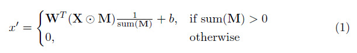
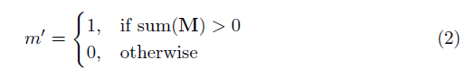
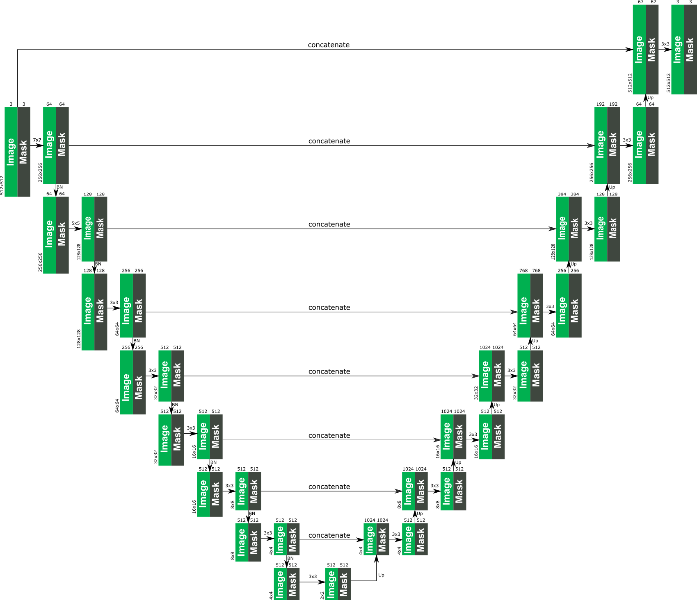
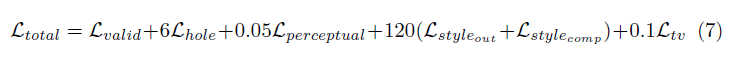

# Partial Convolutions for Image Inpainting using Keras
Keras implementation of "*Image Inpainting for Irregular Holes Using Partial Convolutions*", https://arxiv.org/abs/1804.07723. A huge shoutout the authors Guilin Liu, Fitsum A. Reda, Kevin J. Shih, Ting-Chun Wang, Andrew Tao and Bryan Catanzaro from NVIDIA corporation for releasing this awesome paper, it's been a great learning experience for me to implement the architecture, the partial convolutional layer, and the loss functions. 


# Dependencies
* Python 3.6
* Keras 2.2.4
* Tensorflow 1.12

# How to use this repository
The easiest way to try a few predictions with this algorithm is to go to [www.fixmyphoto.ai](https://www.fixmyphoto.ai/), where I've deployed it on a serverless React application with AWS lambda functions handling inference.

If you want to dig into the code, the primary implementations of the new `PConv2D` keras layer as well as the `UNet`-like architecture using these partial convolutional layers can be found in `libs/pconv_layer.py` and `libs/pconv_model.py`, respectively - this is where the bulk of the implementation can be found. Beyond this I've set up four jupyter notebooks, which details the several steps I went through while implementing the network, namely:

Step 1: Creating random irregular masks<br />
Step 2: Implementing and testing the implementation of the `PConv2D` layer<br />
Step 3: Implementing and testing the UNet architecture with `PConv2D` layers<br />
Step 4: Training & testing the final architecture on ImageNet<br />
Step 5: Simplistic attempt at predicting arbitrary image sizes through image chunking

## Pre-trained weights
I've ported the VGG16 weights from PyTorch to keras; this means the `1/255.` pixel scaling can be used for the VGG16 network similarly to PyTorch. 
* [Ported VGG 16 weights](https://drive.google.com/open?id=1HOzmKQFljTdKWftEP-kWD7p2paEaeHM0)
* [PConv on Imagenet](https://drive.google.com/open?id=1OdbuNJj4gV9KUoknQG063jJrJ1srhBvU)
* PConv on Places2 [needs training]
* PConv on CelebaHQ [needs training]

## Training on your own dataset
You can either go directly to [step 4 notebook](https://github.com/MathiasGruber/PConv-Keras/blob/master/notebooks/Step4%20-%20Imagenet%20Training.ipynb), or alternatively use the CLI (make sure to download the converted VGG16 weights):
```
python main.py \
    --name MyDataset \
    --train TRAINING_PATH \
    --validation VALIDATION_PATH \
    --test TEST_PATH \
    --vgg_path './data/logs/pytorch_to_keras_vgg16.h5'
```

# Implementation details
Details of the implementation are in the [paper itself](https://arxiv.org/abs/1804.07723), however I'll try to summarize some details here.

## Mask Creation
In the paper they use a technique based on occlusion/dis-occlusion between two consecutive frames in videos for creating random irregular masks - instead I've opted for simply creating a simple mask-generator function which uses OpenCV to draw some random irregular shapes which I then use for masks. Plugging in a new mask generation technique later should not be a problem though, and I think the end results are pretty decent using this method as well.

## Partial Convolution Layer
A key element in this implementation is the partial convolutional layer. Basically, given the convolutional filter **W** and the corresponding bias *b*, the following partial convolution is applied instead of a normal convolution:



where ⊙ is element-wise multiplication and **M** is a binary mask of 0s and 1s. Importantly, after each partial convolution, the mask is also updated, so that if the convolution was able to condition its output on at least one valid input, then the mask is removed at that location, i.e.



The result of this is that with a sufficiently deep network, the mask will eventually be all ones (i.e. disappear)

## UNet Architecture
Specific details of the architecture can be found in the paper, but essentially it's based on a UNet-like structure, where all normal convolutional layers are replace with partial convolutional layers, such that in all cases the image is passed through the network alongside the mask. The following provides an overview of the architecture.


## Loss Function(s)
The loss function used in the paper is kinda intense, and can be reviewed in the paper. In short it includes:

* Per-pixel losses both for maskes and un-masked regions
* Perceptual loss based on ImageNet pre-trained VGG-16 (*pool1, pool2 and pool3 layers*)
* Style loss on VGG-16 features both for predicted image and for computed image (non-hole pixel set to ground truth)
* Total variation loss for a 1-pixel dilation of the hole region

The weighting of all these loss terms are as follows:


## Training Procedure
Network was trained on ImageNet with a batch size of 1, and each epoch was specified to be 10,000 batches long. Training was furthermore performed using the Adam optimizer in two stages since batch normalization presents an issue for the masked convolutions (since mean and variance is calculated for hole pixels).

**Stage 1**
Learning rate of 0.0001 for 50 epochs with batch normalization enabled in all layers

**Stage 2**
Learning rate of 0.00005 for 50 epochs where batch normalization in all encoding layers is disabled.

Training time for shown images was absolutely crazy long, but that is likely because of my poor personal setup. The few tests I've tried on a 1080Ti (with batch size of 4) indicates that training time could be around 10 days, as specified in the paper.
